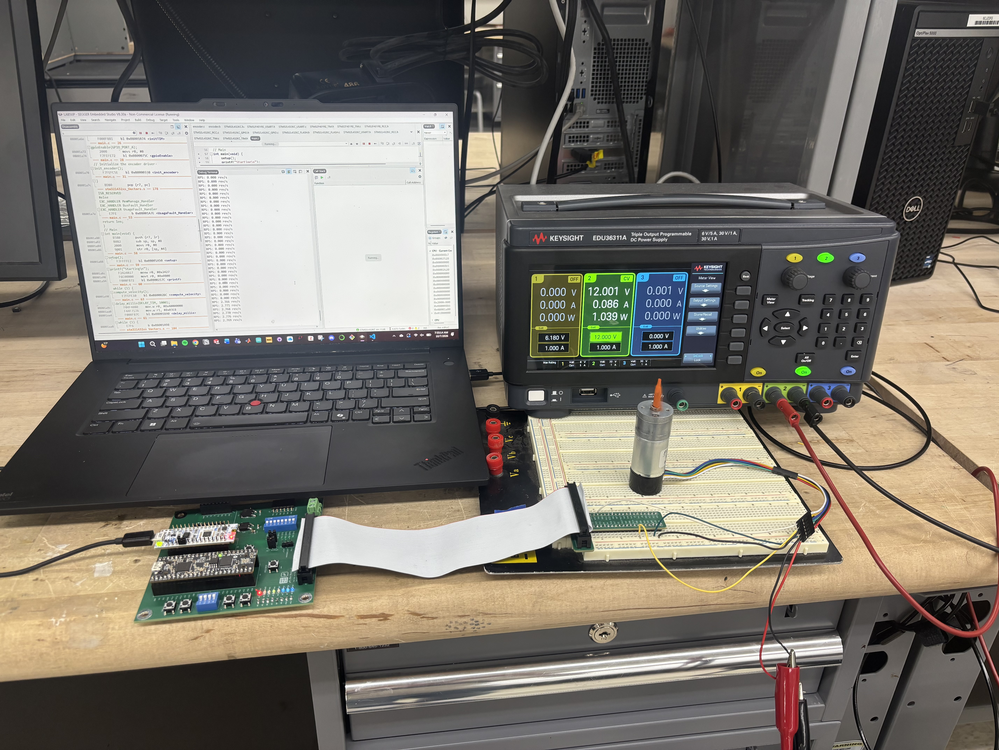
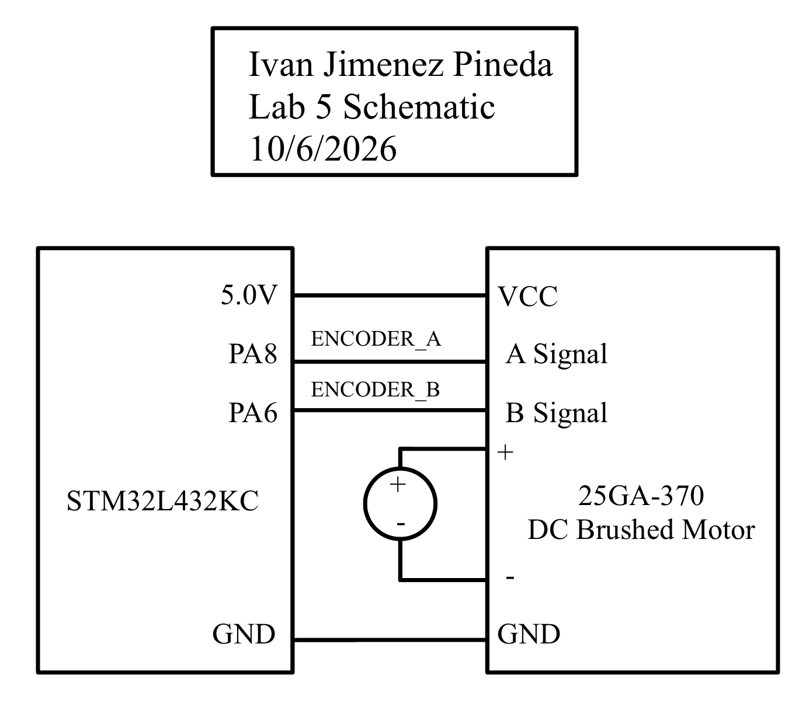
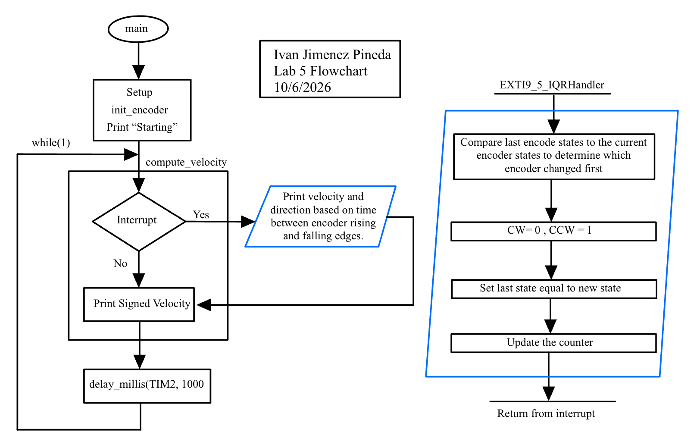

## Introduction

In this lab, the STM32L432KC microcontroller was configured to measure the rotational velocity and direction of a 25GA-370 brushed DC motor. A quadrature encoder attached to the motor generates pulse signals that were tracked using hardware interrupts. By triggering external interrupts (EXTI) on both the rising and falling edges of the two out-of-phase encoder channels, the system achieves high-resolution measurements to accurately calculate and display the motor's speed in revolutions per second (rev/s) at a 1 Hz update rate.

*Figure 1: Complete wiring including the STM32L432KC and 25GA-370 brushed DC motor.*

[View the Source Code on GitHub](https://github.com/IvanJimenezPineda4/E155-Lab-5)

## Hardware Specifications & Schematic

The quadrature encoder utilizes two Hall effect sensors to measure the changing magnetic field as the motor shaft rotates. The sensors output 5V logic signals. Because the STM32L432KC operates on 3.3V logic, the encoder's A and B channels were connected specifically to pins `PA8` and `PA6`, which are 5V-tolerant.

*Figure 2: Schematic of the off-board encoder circuit.*

On-board MCU components and internal pull-ups are not replicated in this schematic; they can be referenced in the motherboard schematic here.
[View the Motherboard Schematic](https://hmc-e155.github.io/assets/doc/E155%20FA22%20Development%20Board%20Schematic.pdf)

## Software and Microcontroller Design

The system architecture is divided into a high-level application loop (`main.c`) and a encoder driver (`encoder.c` and `encoder.h`). The driver initializes the GPIO pins, routes the EXTI lines using the `SYSCFG` registers, and configures the Nested Vector Interrupt Controller (NVIC) to trigger the `EXTI9_5_IRQHandler` on every logic transition.

### Flowchart

*Figure 3: Flowchart illustrating the main loop, setups, and interrupt sequence of the system.*

### Velocity and Direction Calculations

The 25GA-370 motor has a specified Pulse Per Revolution (PPR) of 408. Because the interrupt service routine (ISR) triggers on both the rising and falling edges of both Channel A and Channel B, there are 4 distinct state transitions per pulse. This yields a total resolution of 408 X 4 = 1,632 counts per full motor revolution.

The ISR updates a shared `volatile int32_t counter`. Every 1000 milliseconds (managed by `TIM2`), the main loop briefly disables the EXTI interrupts to atomically read and reset this counter.

Velocity is calculated using the following equation:

$\text{Velocity (rev/s)} = \frac{\text{Current Count}}{408 \text{ pulses/rev} \times 4 \text{ edges/pulse}}$

Direction is determined in the ISR by comparing the previous state of the two pins to their current state. For example, if both pins were LOW (`00`) and Channel A transitions HIGH (`10`), Channel A is leading, indicating clockwise (CW) rotation. The calculated speed is then paired with this direction state for output over the ITM debug channel.

### Interrupts vs. Polling

While a continuous polling loop can detect logic changes, it introduces reliability issues at high speeds.

At a 12V supply, the motor spins at roughly 150 RPM, or 2.5 rev/s. Given our resolution of 1,632 edges per revolution, the encoder generates a signal state change at a frequency of:
$2.5 \text{ rev/s} \times 1,632 \text{ edges/rev} = 4,080 \text{ Hz}$

This means an edge occurs approximately every 245 μs. According to the Nyquist-Shannon sampling theorem, a polling loop would need to successfully sample the pins at greater than 8,160 Hz (a loop time of 122 μs) to avoid missing a pulse. However, our main loop utilizes a blocking 1,000 ms delay and relies on floating-point `printf` operations. During this time, the polling loop is entirely paused, meaning thousands of encoder pulses would be missed, resulting in aliasing and an inaccurate velocity calculation.

By utilizing EXTI interrupts, the MCU bypasses the main loop entirely. The ISR takes only a few dozen clock cycles to execute (less than 1 μs on an 80 MHz clock). Therefore, the interrupt based code guarantees zero missed pulses at maximum motor speeds, while still registering non-zero velocities at low speeds where a 1 Hz polling loop might incorrectly register stationary behavior due to clipping.

## Results and Requirements Statement

The design meets all requirements outlined in the Lab 5 specifications:
* The system utilizes interrupts to read both edges of both encoder channels, capturing all pulses at normal and high speeds.
* Motor velocity is calculated in rev/s and displayed via the ITM debug channel at an update rate of 1 Hz.
* The measured speed appropriately registers as `0.000 rev/s` when the motor is stationary.
According to the datasheet, at 12V the motor spins at roughly 150 RPM (2.5 rev/s). My debug terminal measured ~2.9 rev/s at 12V, verifying that the calculations and direction states match the true physical motor speed.

## AI Prototype

### LLM Prompt
> Write me interrupt handlers to interface with a quadrature encoder. I’m using the STM32L432KC, what pins should I connect the encoder to in order to allow it to easily trigger the interrupts?

### Reflection

**Quality of Output**
The quality of ChatGPT 5.0's response was good but had some downsides. The LLM accurately explained quadrature decoding and provided a bit-shifting state machine to handle the logic. However, it recommended pins `PA0` and `PA1`. According to the STM32L432KC datasheet, these pins are not 5V-tolerant so connecting our 5V lab encoder directly to them could damage the board. The LLM also generated code using the STM32 Hardware Abstraction Layer (HAL) library instead of using CMSIS.

**Code Generation Comparison**
Because of the HAL library usage, the generated code would not compile in my Segger Embedded Studio setup. My final design manually configures the `SYSCFG`, `EXTI`, and `NVIC` registers and relies on the `EXTI9_5_IRQHandler` mapped to the 5V-tolerant `PA6` and `PA8` pins. For the decoding logic, the LLM used a `switch` statement evaluating a 4-bit previous/current state (`(encoder_state << 2) | new_state`). I used explicit if/else logic gates in my implementation to make the hardware-level state transitions more readable and easier to debug.

## Time Spent

**Hours spent working on the lab:** *(19 Hours)*